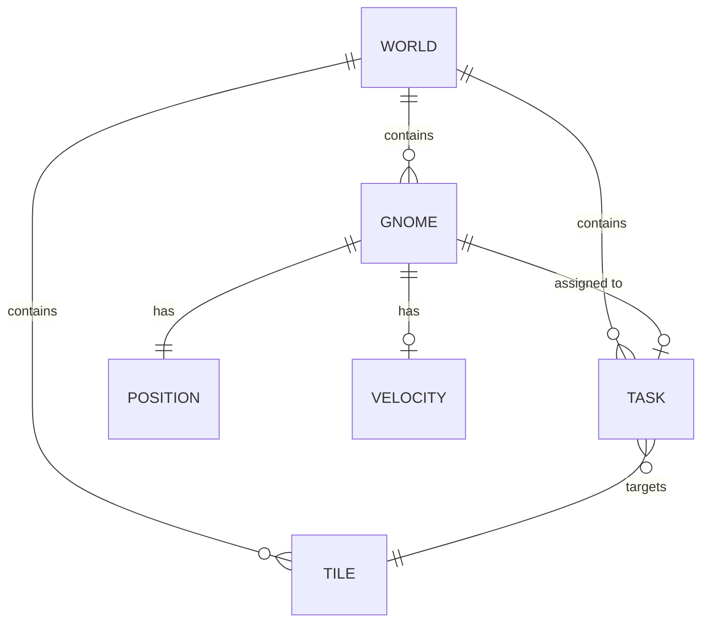

# Data Model: Colony Simulation Core (MVP)

**Date**: 2025-12-11
**Branch**: `001-colony-sim-core`

## Overview

This document defines the core data structures for the MVP. Following the constitution's Entity-Component-System architecture, all game objects are represented as entities (numeric IDs) with associated component data (plain objects).

---

## Core Types

### Entity

```typescript
/**
 * Entity is a unique identifier for any game object.
 * Components are associated with entities via Maps.
 */
type Entity = number;
```

### World State

```typescript
/**
 * The complete game state. Must be JSON-serializable for save/load.
 */
interface GameState {
  // Metadata
  seed: number;                    // World generation seed
  tick: number;                    // Current simulation tick
  isPaused: boolean;               // Pause state
  speed: GameSpeed;                // 0.5x, 1x, 2x multiplier

  // Entity management
  nextEntityId: Entity;            // Auto-incrementing ID counter

  // World grid
  worldWidth: number;              // Tiles wide
  worldHeight: number;             // Tiles tall
  tileGrid: (Entity | null)[][];   // 2D grid of tile entities (null = air)

  // Component storage (Maps serialized as arrays of [key, value])
  positions: Map<Entity, Position>;
  tiles: Map<Entity, Tile>;
  gnomes: Map<Entity, Gnome>;
  tasks: Map<Entity, Task>;
  velocities: Map<Entity, Velocity>;

  // Camera state
  camera: Camera;
}

type GameSpeed = 0.5 | 1 | 2;
```

---

## Components

### Position

```typescript
/**
 * World position in tile coordinates.
 * For entities that can move between tiles (gnomes).
 */
interface Position {
  x: number;  // Tile X (0 = left edge)
  y: number;  // Tile Y (0 = top edge)
}
```

### Velocity

```typescript
/**
 * Movement vector for interpolation between tiles.
 * Used by gnomes during movement animation.
 */
interface Velocity {
  dx: number;  // Tiles per tick (usually fractional)
  dy: number;
}
```

### Tile

```typescript
/**
 * Terrain tile data. Every non-air tile in the world.
 */
interface Tile {
  type: TileType;
  durability: number;  // Mining progress (0 = mined)
}

enum TileType {
  Air = 0,    // Empty space (no entity needed)
  Dirt = 1,   // Fast to mine
  Stone = 2,  // Slow to mine
}

/**
 * Tile type properties (constants, not stored per-tile).
 */
const TILE_CONFIG: Record<TileType, TileConfig> = {
  [TileType.Air]: { durability: 0, color: 0x87CEEB, mineTicks: 0 },
  [TileType.Dirt]: { durability: 100, color: 0x8B4513, mineTicks: 30 },
  [TileType.Stone]: { durability: 200, color: 0x808080, mineTicks: 90 },
};

interface TileConfig {
  durability: number;  // Initial durability
  color: number;       // Hex color for MVP rendering
  mineTicks: number;   // Ticks to mine at base speed
}
```

### Gnome

```typescript
/**
 * Gnome entity data. The controllable unit.
 */
interface Gnome {
  state: GnomeState;
  currentTaskId: Entity | null;  // Active task entity
  path: Position[] | null;       // Current pathfinding result
  pathIndex: number;             // Progress through path
}

enum GnomeState {
  Idle = 'idle',
  Walking = 'walking',
  Mining = 'mining',
  Falling = 'falling',
}
```

### Task

```typescript
/**
 * A queued task for gnomes to execute.
 */
interface Task {
  type: TaskType;
  targetX: number;           // Target tile X
  targetY: number;           // Target tile Y
  priority: TaskPriority;    // Execution order
  createdAt: number;         // Tick when created (for FIFO)
  assignedGnome: Entity | null;  // Which gnome is working on it
  progress: number;          // 0-100 completion percentage
}

enum TaskType {
  Dig = 'dig',
}

enum TaskPriority {
  Low = 0,
  Normal = 1,
  High = 2,
  Urgent = 3,
}
```

### Camera

```typescript
/**
 * Viewport camera state.
 */
interface Camera {
  x: number;       // Center position in world pixels
  y: number;
  zoom: number;    // 1.0 = 100%, 0.5 = 50%, 2.0 = 200%
  targetX: number; // Smooth pan target
  targetY: number;
}
```

---

## Commands (Player Input)

```typescript
/**
 * Discrete player actions captured for deterministic replay.
 */
type Command =
  | { type: 'SELECT_TILES'; tiles: { x: number; y: number }[] }
  | { type: 'DIG'; tiles: { x: number; y: number }[] }
  | { type: 'CANCEL_TASK'; taskId: Entity }
  | { type: 'PAN_CAMERA'; dx: number; dy: number }
  | { type: 'ZOOM_CAMERA'; delta: number }
  | { type: 'SET_SPEED'; speed: GameSpeed }
  | { type: 'TOGGLE_PAUSE' };

interface CommandEnvelope {
  command: Command;
  tick: number;  // When issued
}
```

---

## Entity Relationships



### Relationship Rules

1. **Gnome → Task**: One gnome can have at most one active task (`currentTaskId`).
2. **Task → Gnome**: One task can be assigned to at most one gnome (`assignedGnome`).
3. **Task → Tile**: A task targets a specific tile position.
4. **Tile grid**: The `tileGrid` array holds entity IDs; `null` means air (no entity).

---

## State Transitions

### Gnome State Machine

```
┌─────────┐     task assigned     ┌─────────┐
│  Idle   │ ─────────────────────→│ Walking │
└─────────┘                       └─────────┘
     ↑                                 │
     │ task complete                   │ reached target
     │ or cancelled                    ↓
     │                            ┌─────────┐
     └────────────────────────────│ Mining  │
                                  └─────────┘
                                       │
                                       │ ground removed
                                       ↓
                                  ┌─────────┐
                                  │ Falling │
                                  └─────────┘
                                       │
                                       │ landed
                                       ↓
                                    (Idle or Walking if task remains)
```

### Task Lifecycle

```
Created → Queued → Assigned → InProgress → Completed
                      │                        │
                      └──────── Cancelled ─────┘
```

---

## Serialization

For save/load, the GameState is serialized to JSON:

```typescript
interface SerializedGameState {
  seed: number;
  tick: number;
  isPaused: boolean;
  speed: GameSpeed;
  nextEntityId: number;
  worldWidth: number;
  worldHeight: number;
  tileGrid: (number | null)[][];  // Entity IDs
  positions: [number, Position][];
  tiles: [number, Tile][];
  gnomes: [number, Gnome][];
  tasks: [number, Task][];
  velocities: [number, Velocity][];
  camera: Camera;
}

function serialize(state: GameState): string {
  return JSON.stringify({
    ...state,
    positions: Array.from(state.positions.entries()),
    tiles: Array.from(state.tiles.entries()),
    gnomes: Array.from(state.gnomes.entries()),
    tasks: Array.from(state.tasks.entries()),
    velocities: Array.from(state.velocities.entries()),
  });
}

function deserialize(json: string): GameState {
  const data: SerializedGameState = JSON.parse(json);
  return {
    ...data,
    positions: new Map(data.positions),
    tiles: new Map(data.tiles),
    gnomes: new Map(data.gnomes),
    tasks: new Map(data.tasks),
    velocities: new Map(data.velocities),
  };
}
```

---

## Constants (MVP)

```typescript
const TILE_SIZE = 16;           // Pixels per tile
const WORLD_WIDTH = 100;        // Tiles
const WORLD_HEIGHT = 50;        // Tiles
const TICK_RATE = 60;           // Ticks per second
const GNOME_SPEED = 0.1;        // Tiles per tick (6 tiles/second)
const GNOME_MINE_RATE = 1;      // Durability per tick
const INITIAL_GNOME_COUNT = 1;  // MVP: single gnome
```
