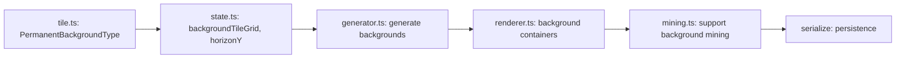

# Research: Background Blocks & Horizon System

**Phase 0 Output** | **Date**: 2025-12-21 | **Spec**: [spec.md](./spec.md)

## Executive Summary

Este documento analisa a codebase existente e define decisões técnicas para implementar o sistema de background blocks e horizonte. A arquitetura atual já suporta extensão para camadas adicionais sem modificações estruturais significativas.

## Codebase Analysis

### 1. Rendering System (renderer.ts)

**Current Architecture:**
```typescript
interface Renderer {
  worldContainer: Container;    // Tiles e buildings
  entityContainer: Container;   // Gnomes e resources
  uiContainer: Container;       // Selection e task markers
  tileGraphics: Map<number, Graphics>;
}
```

**Rendering Pipeline:**
1. Tiles renderizados em `worldContainer` como Graphics retângulos
2. Cada tile em `(x * TILE_SIZE, y * TILE_SIZE)` onde `TILE_SIZE = 16`
3. Dirty checking implementado (só redesenha tiles alterados)
4. Frustum culling ativo (só tiles visíveis são processados)

**Extension Point:**
- Adicionar `backgroundContainer` ANTES do `worldContainer`
- Adicionar `permanentBackgroundContainer` como primeira camada
- Manter dirty checking para backgrounds

### 2. World Generation (generator.ts)

**Current Algorithm:**
```typescript
interface WorldConfig {
  width: number;        // 100 tiles
  height: number;       // 50 tiles
  seed: number;
  surfaceLevel: number; // 0.3 (30% from top)
  dirtDepth: number;    // 5 tiles
}
```

**Generation Flow:**
1. Itera column-by-column (x, depois y)
2. Noise function adiciona variação de superfície (±2 tiles)
3. Layers: Air → Dirt → Stone → Bedrock (bordas)

**Extension Point:**
- `surfaceLevel * height` pode servir como `horizonY`
- Gerar `backgroundTileGrid` em paralelo com `tileGrid`
- Background blocks criados apenas onde há foreground sólido

### 3. Game State (state.ts)

**Current Structure:**
```typescript
interface GameState {
  tileGrid: (Entity | null)[][];  // Foreground tiles
  tiles: Map<Entity, Tile>;       // Tile components
  worldWidth: number;
  worldHeight: number;
  // ... outras propriedades
}
```

**Serialization:**
- Maps convertidos para arrays via `serialize()`/`deserialize()`
- Backwards-compatibility layer existente

**Extension Point:**
- Adicionar `backgroundTileGrid: (Entity | null)[][]`
- Adicionar `backgroundTiles: Map<Entity, Tile>` (ou reutilizar `tiles`)
- Adicionar `horizonY: number` como propriedade do mundo

### 4. Tile System (tile.ts)

**Current Types:**
```typescript
enum TileType {
  Air = 0,
  Dirt = 1,
  Stone = 2,
  Bedrock = 3
}

interface Tile {
  type: TileType;
  durability: number;
}
```

**Extension Point:**
- Reutilizar `TileType` para background blocks (mesmos tipos)
- Criar enum separado `PermanentBackgroundType { Sky, Cave }` para layer permanente

### 5. Mining System (mining.ts)

**Current Flow:**
1. Gnome com tarefa Dig → reduz durability do tile
2. Durability ≤ 0 → converte para Air, dropa resource
3. Task marcada como completa

**Extension Point:**
- Modificar para checar se há foreground antes de minar background
- Background mining não dropa resources (por spec)
- Reutilizar mesmo fluxo de tarefas

### 6. Color System (colors.ts)

**Current Colors:**
```typescript
SKY_COLOR = 0x87ceeb        // Background atual
DIRT_COLOR = 0x8b4513
STONE_COLOR = 0x808080
BEDROCK_COLOR = 0x1a1a1a
```

**Extension Point:**
- Background blocks: cores dessaturadas/escuras do foreground
- Sky permanent: manter `0x87ceeb`
- Cave permanent: novo valor escuro (~`0x2a2a2a`)

## Technical Decisions

### Decision 1: Background Grid Strategy

**Opções Consideradas:**
1. **Grid separado** (`backgroundTileGrid: (Entity | null)[][]`) - ESCOLHIDO
2. **Tile único com layers** (`Tile { foreground: TileType, background: TileType }`)
3. **Z-index por entity** (entity com z-position)

**Escolha:** Grid separado

**Justificativa:**
- Alinhado com arquitetura ECS existente (entities são componentes simples)
- Permite dirty checking independente por layer
- Serialização segue mesmo padrão do tileGrid existente
- Mineração de background tem entidade própria (task targetEntity)

### Decision 2: Container Hierarchy

**Nova hierarquia de containers PixiJS:**
```
Application
├── permanentBackgroundContainer (z: 0) - Sky/Cave fill
├── backgroundContainer (z: 1) - Background blocks
├── worldContainer (z: 2) - Foreground blocks, buildings
├── entityContainer (z: 3) - Gnomes, resources
└── uiContainer (z: 4) - Selection, tasks
```

**Justificativa:**
- Containers PixiJS já têm z-order implícito por ordem de adição
- Frustum culling pode ser aplicado por container
- Permanent background pode ser renderizado como fill simples (sem tiles individuais)

### Decision 3: Permanent Background Rendering

**Opções Consideradas:**
1. **Tiles individuais** - cada posição tem entity Sky/Cave
2. **Fill por região** - retângulo único acima/abaixo do horizonte - ESCOLHIDO
3. **Gradiente contínuo** - transição suave

**Escolha:** Fill por região

**Justificativa:**
- Permanent background não é interativo (não precisa de entities)
- Performance muito melhor (2 draws vs milhares)
- Transição clara no horizonte (spec requirement)

### Decision 4: Background Block Visual Style

**Fórmula para cores de background:**
```typescript
function getBackgroundColor(foregroundColor: number): number {
  // Escurecer 40% e dessaturar 30%
  const r = ((foregroundColor >> 16) & 0xff) * 0.6;
  const g = ((foregroundColor >> 8) & 0xff) * 0.6;
  const b = (foregroundColor & 0xff) * 0.6;
  return (Math.floor(r) << 16) | (Math.floor(g) << 8) | Math.floor(b);
}
```

**Justificativa:**
- Visual claramente distinto (spec FR-007)
- Fórmula determinística (consistency)
- Pode ser ajustado para style guide futuro (013)

### Decision 5: Horizon Configuration

**Implementação:**
```typescript
interface WorldConfig {
  // ... existing
  horizonY?: number; // Default: surfaceLevel * height
}

interface GameState {
  // ... existing
  horizonY: number; // Persisted, não recalculado
}
```

**Justificativa:**
- Valor configurável na geração (spec requirement)
- Persistido no save (não muda após geração)
- Default inteligente baseado em surfaceLevel existente

### Decision 6: Mining Priority

**Regra de mineração:**
```typescript
function getMineableTarget(state, x, y): { entity: Entity, layer: 'foreground' | 'background' } | null {
  const foreground = getTileAt(state, x, y);
  if (foreground && !isAir(foreground)) {
    return { entity: foreground, layer: 'foreground' };
  }
  const background = getBackgroundTileAt(state, x, y);
  if (background && !isAir(background)) {
    return { entity: background, layer: 'background' };
  }
  return null; // Permanent background não minerável
}
```

**Justificativa:**
- Foreground sempre tem prioridade (spec FR-008 edge case)
- Lógica simples e determinística
- Player não precisa de nova UI para selecionar layer

## Performance Analysis

### Current Performance:
- 60 FPS com ~5000 tiles visíveis (100x50 world)
- Dirty checking reduz draw calls significativamente
- Frustum culling limita tiles processados

### Projected Impact:
- +1 container layer (background blocks)
- +2 fill draws (permanent background)
- ~5000 tiles background adicionais (pior caso)
- Dirty checking mitiga impacto

### Mitigation Strategies:
1. **Dirty checking** para background tiles (já implementado para foreground)
2. **Frustum culling** aplicado ao backgroundContainer
3. **Permanent background** como fill único (não tiles)
4. **Cache de cores** para backgrounds (evitar recalcular)

### Expected Result:
- Manter 60 FPS com 10.000 tiles (SC-004)
- Overhead estimado: +5-10% em rendering (aceitável)

## Risks and Mitigations

| Risk | Impact | Probability | Mitigation |
|------|--------|-------------|------------|
| Performance degradation | High | Low | Dirty checking, frustum culling, fill for permanent |
| Save/load incompatibility | Medium | Low | Backwards-compat layer, version check |
| Mining logic bugs | Medium | Medium | Comprehensive unit tests, clear priority rules |
| Visual confusion layers | Low | Low | 40% darkening + dessaturation |

## Open Questions (Resolved)

1. ✅ **Background durability?** → Same as foreground (1:1) - clarified in spec
2. ✅ **Horizon position?** → Configurable Y, default = surfaceLevel * height - clarified in spec
3. ✅ **Resource drops?** → No drops from background mining - in spec assumptions

## Implementation Dependencies



**Critical Path:**
1. Types (tile.ts, background.ts)
2. State (state.ts)
3. Generation (generator.ts)
4. Rendering (renderer.ts)
5. Mining (mining.ts)
6. Persistence (state.ts serialize)

## References

- `/src/lib/render/renderer.ts` - Current rendering implementation
- `/src/lib/game/state.ts` - GameState interface
- `/src/lib/components/tile.ts` - TileType enum
- `/src/lib/world-gen/generator.ts` - World generation
- `/src/lib/systems/mining.ts` - Mining system
- `/src/lib/config/colors.ts` - Color definitions
